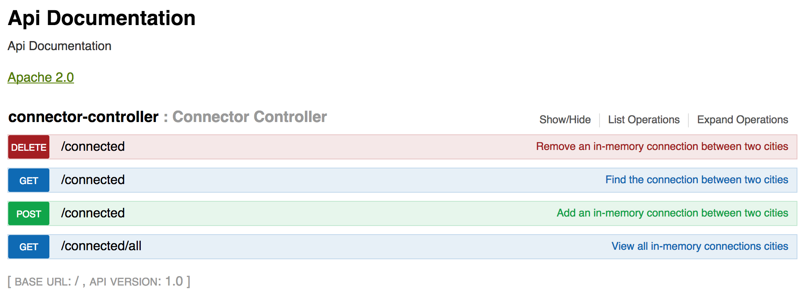

# City Connector App
Given an origin and a destination city names, the application will check if there are routes available or not.

## Getting Started
- check out the code from github and run the following commands
- By default the application will be loaded with the 4 sample city mappings as listed below
    - Boston, New York
    - Philadelphia, Newark
    - Newark, Boston
    - Trenton, Albany
```
./mvnw clean install
./mvnw spring-boot:run
```

### Dynamic Pre-loading Of Data
- If you need to pass data file (city.txt), you can have it created in the app home directory and pass it via argument
- The file contains each city name seperated by a comma as origin and destination
- Each line in the file denotes a mapping
- [Sample City Txt File](city.txt)
```
./mvnw spring-boot:run -Dspring-boot.run.arguments=city.txt
```

## Running the tests
- Application contains an unit test for the core module
- Another mockito test for the service module
- An Integration test by boot strapping a Mock MVC container to load spring context and test HTTP end points  
```
./mvnw test
```

## Documentation
- Once the application is started, you can use the swagger document to try the API calls in real-time

### API Document
- [http://localhost:8080/swagger-ui.html](http://localhost:8080/swagger-ui.html)
-  
    - Use the swagger page to make calls on each REST endpoints
    - The parameters (origin and destination) are mandatory

### REST API Support
- [http://localhost:8080/v2/api-docs](http://localhost:8080/v2/api-docs)
-  **GET /connected** Is used to make a query on a origin and destination and will return yes / no
-  **POST /connected** Is used to add a new origin and destination entry into the in-memory mapping
-  **DELETE /connected** Is used to remove an existing origin and destination entry from the in-memory mapping
-  **GET /connected/all** Is used to see the list of available connection mappings

## Monitoring & Health Check
- Application availability can be checked using [http://localhost:8080/actuator/health](http://localhost:8080/actuator/health)

## Application Logic
- The data is loaded into a concurrent hashmap using the sample data structure like
```
Mappings : boston -> [newyork, newark]
Mappings : newark -> [philadelphia, boston, jerseycity, trenton]
Mappings : trenton -> [albany, newark]
Mappings : newyork -> [boston]
Mappings : albany -> [trenton]
Mappings : philadelphia -> [newark]
Mappings : jerseycity -> [newark]
```
- The above data structure is created by adding both the origin and destinations as 2 distinct keys
- The value denotes all the cities as a collection to which the key city is mapped
- Duplicating of origin & destinations cities is done to save the time during lookups
- While storing city names in the map, the names are trimmed, spaces removed & lower cased to avoid human error in querying 
- During a search query the following steps will be taken
    - check if origin city is available as a key 
    - If its available, check if the destination is any one of the city in the value collection
    - If none of the value collection matches, the program will make a recursive call on each city in the value collection
     by considering them as an intermediate city inorder to reach the final destination
    - Once the destination city is matched, the logic will return true, otherwise it will try all options and return false 

## Versioning
- TODO, its built as snapshot now. 

## Authors
- **Kamal** - *Initial work* - [18scorpii](https://github.com/18scorpii)

